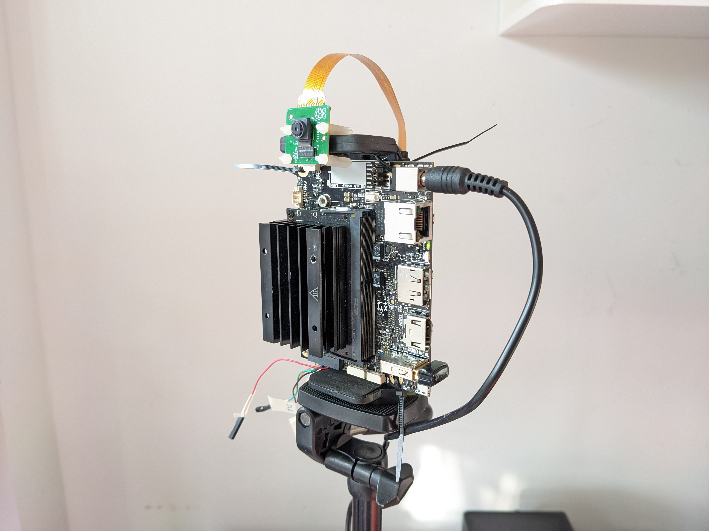

# WandB webhooks for ML experiments on an NVIDIA Jetson Nano (or other Jetson version).

This repo demonstrates using webhooks to train, retrain, and download wandb artifacts to an edge device (NVIDIA Jetson) using wandb webhooks.

Experimenting with ML on edge devices is a deeply fascinating task that drives at the core of many of the underlying aspects that are scaled to much bigger/scaled applications.

Demonstrating what can be achived on edge devices is important for a number of reasons:
1. If you can do it small, it can be scaled -- the converse is not always true.
2. They have real world applications of low power solutions and can be used to deploy real world ML edge cases
3. Edge devices are often whole computers in a nutshell that can control/ interact/ 'live' in specific applications (eg. an automated (x) that uses face recognition) where x is some real world appliction such as opening a door or feeding your cat.

While edge applications in general are a fascinating field in their own right -- it is also possible to have a lab in one's living room and experiment with tools and techniques that can be applied much more broadly, including aspects of:

- Networking and how communication actually happens over the internet.
- Linux OS setup.
- Conducting ML cheaply on a real GPU.
- Using tools such as Docker and orchestration tooling such as K8S (you can build clusters of small computers).
- Building servers.
- Connecting devices that will actually handle real-world signals -- such as a camera (see image below)

A notebook providing a high-level 101 into what a webhook is doing [here](https://colab.research.google.com/drive/1PdR7tzXbBp7HupE3pq633cHR7Qs-ub8x?usp=sharing)

Project demoing using wandb webhooks [here](https://wandb.ai/jetson-nano-train/quantized%20edge%20training)

Applying the alias `download` on either data artifact or model artifact will download data to Nvidia Jetson and initialize retraining.

## Assumptions made in order to run this independently
- That you have set up your NVIDIA Jetson device:
    - Installing on a carrier board (I did this from scratch)
    - Flashing Linux Ubuntu via JetPack (NVIDIA custom device manager)
    - Configuring CUDA (this can be a little tricky) and requires some deep diving on NVIDIA forums
- Have set up port forwarding on your home router/firewall to the internal IP of your Jetson on the local network.
- Have set up SSH to be able to SSH into your Jetson (either via public IP or private IP of your Jetson).
- Use a service such as NOIP to set up a hostname (a listed URL) that is associated with your home router (which is very likely operating on a dynamic IP)

#### It is important to note here that there are security considerations to the above -- as in you are exposing your device to the public internet. Ubuntu has a default firewall -- however, the authors are absolutely not security experts and the process shared is very much in the spirit of "MVP" and experimenting purposes rather than real production. You might simply switch off your device and remove port forwarding on your home router/firewall once you are done, but please take your own precautions.

webhook.py runs a super simple web server in Python which listens for incoming signals -- in this case, it has a real IP on a real device which is serving from an NVIDIA Jetson exposed to the public internet.

This can simply be run with `python webhook.py` from an NVIDIA Jetson (or any other edge device configured in the same way)

## To Do:
- [ ] Add args to automation in payload
- [ ] Add args parser
- [ ] Setup in Docker
- [ ] Add inference step